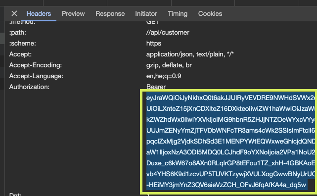

# py-iec

A python wrapper for Israel Electric Company API

## Technology and Resources

- [Python 3.11](https://www.python.org/downloads/release/python-3110/) - **pre-requisite**
- [Docker](https://www.docker.com/get-started) - **pre-requisite**
- [Docker Compose](https://docs.docker.com/compose/) - **pre-requisite**
- [Poetry](https://python-poetry.org/) - **pre-requisite**
- [Ruff](https://github.com/astral-sh/ruff)
- [Dynaconf](https://www.dynaconf.com/)

*Please pay attention on **pre-requisites** resources that you must install/configure.*

## (Temporary) How to get JWT token?

First, enter www.iec.co.il.

Open DevTools (You can use Option + ⌘ + J (on macOS), or Shift + CTRL + J (on Windows/Linux)).

Go to Network tab, and filter by `customer`

Login with your ID and go through the SMS OTP token.

When you'll see the GET request to `customer` endpoint, open the `headers` tab and copy the `Authorization` header without the word **Bearer**

This is your token




## Module Usage

```python
    try:
        client = IecApiClient("123456789")
        # client.login() - (Still not working)
        token = input("Input bearer token: ") # you have to override the JWT token manually for now 
        client.override_token(token)
        customer = client.get_customer()
        print(customer)

        contracts = client.get_contracts()
        for contract in contracts:
            print(contract)

        reading = client.get_last_meter_reading(customer.bp_number, contracts[0].contract_id)
        print(reading)
    except IECLoginError as err:
        logger.error("Failed Login: (Code %d): %s", err.code, err.error)
```

## How to install, run and test

### Environment variables

*Use this section to explain each env variable available on your application* 

Variable | Description | Available Values | Default Value | Required
--- | --- | --- | --- | ---
ENV | The application enviroment |  `development / test / qa / prod` | `development` | Yes

*Note: When you run the install command (using docker or locally), a .env file will be created automatically based on [env.template](env.template)*

Command | Docker | Locally | Description
---- | ------- | ------- | -------
install | `make docker/install` | `make local/install` | to install
tests | `make docker/tests` | `make local/tests` | to run the tests with coverage
lint | `make docker/lint` | `make local/lint` | to run static code analysis using ruff
lint/fix | `make docker/lint/fix` | `make local/lint/fix` | to fix files using ruff
run | `make docker/run` | `make local/run` | to run the project

**Helpful commands**

*Please, check all available commands in the [Makefile](Makefile) for more information*.

## Logging

This project uses a simple way to configure the log with [logging.conf](logging.conf) to show the logs on the container output console.
